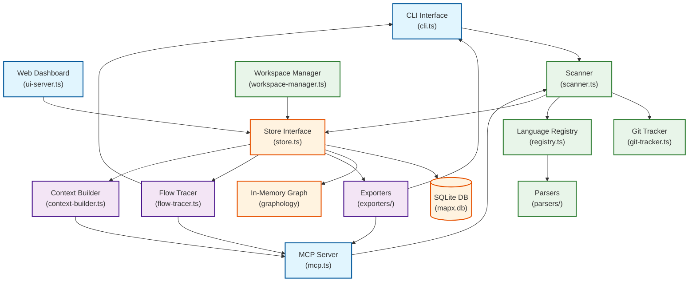

<h1 align="center">MapX</h1>

<p align="center">
<a href="https://npmjs.org/package/@mgamil/mapx">

</a>
<a href="https://github.com/MohamedGamil/mapx/actions/workflows/ci.yml">

</a>
<a href="https://coveralls.io/github/MohamedGamil/mapx">

</a>
<a href="https://npmjs.org/package/@mgamil/mapx">

</a>
</p>

<br>
<br>

<p align="center">
<strong>Local code graph memory for LLMs.</strong><br>
<em>Scan your codebase once — instantly query symbols, trace dependencies, analyze impact, and generate structured summaries without re-reading files.</em>
</p>

<br>
<br>

## Why MapX?

* **Lightweight & Fast** - Parses files in parallel with WebAssembly tree-sitter grammars and writes to a local SQLite database in milliseconds.
* **87% LLM Cost Reduction** - Feeds exact signatures and dependency pathways to LLM agents rather than reading raw files, slashing token usage.
* **Deep Symbol Extraction** - Automatically extracts classes, methods, functions, interfaces, traits, structs, modules, and namespaces with their reference lines and call graphs.
* **Incremental & Resumable Scans** - Git-aware change tracker only scans modified files. Interrupted scans resume exactly where they left off.
* **Framework Intelligent** - Auto-detects 21 web frameworks (Laravel, Next.js, Django, Spring, etc.) to map out routing paths and hook bindings.
* **26 MCP Tools** - Seamlessly integrates with Claude Desktop, Cursor, VS Code, and other MCP clients to empower AI coding agents.
* **Zero Cloud** - All parsed metadata and graphs stay completely local within the `.mapx/` directory of your project.

<br>

## Table of Contents

<details>
<summary>Click to expand</summary>

- [Features](#features)
- [Installation](#installation)
  - [From npm (Global Installation)](#from-npm-global-installation)
  - [Zero Installation (via npx)](#zero-installation-via-npx)
  - [Pre-built binary](#pre-built-binary)
  - [From source](#from-source)
- [Quick Start](#quick-start)
- [Commands](#commands)
- [Token Consumption Benchmarks](#token-consumption-benchmarks)
- [MCP Integration](#mcp-integration)
  - [Claude Desktop](#claude-desktop-claude_desktop_configjson)
  - [Cursor / VS Code](#cursor--vs-code-cursor-mcpjson)
  - [Available MCP tools (26 total)](#available-mcp-tools-26-total)
- [Programmatic Usage](#programmatic-usage)
- [Supported Languages](#supported-languages)
  - [Built-in (Tier 1) — Dedicated Parsers](#built-in-tier-1--dedicated-parsers)
  - [Bundled (Tier 2) — Generic WASM Parsers (Always Available)](#bundled-tier-2--generic-wasm-parsers-always-available)
- [Agentic Integration](#agentic-integration)
- [Storage](#storage)
- [Architecture](#architecture)
- [Documentation](#documentation)
- [Development](#development)
  - [npm script shortcuts](#npm-script-shortcuts)
  - [Makefile shortcuts](#makefile-shortcuts)
  - [Building binaries](#building-binaries)
- [License](#license)

</details>

<br>
<hr>

## Features

- **22 languages** — all built-in or bundled with the package out-of-the-box (PHP, JS, TS, Python, Go, Rust, Java, C#, Ruby, C, C++, Swift, Kotlin, Scala, Vue, Svelte, Lua, Elixir, Zig, Bash, Pascal, Dart)
- **Deep symbol extraction** — classes, methods, functions, interfaces, traits, enums, structs, modules, constants, properties, namespaces — with full import/inheritance/instantiation reference tracking
- **Incremental scans** — git-aware change detection; only re-parses files that changed
- **Fast** — parallelised file reads, bounded WASM concurrency, batched SQLite writes
- **Resumable** — scan progress is checkpointed; `Ctrl+C` and re-run picks up where it left off
- **26 MCP tools** — scan, query, search, trace, callers, callees, impact, export, context, batch, workspaces, and more
- **Flexible search** — wildcard (`*`), glob patterns (`*Service`, `get?`), fuzzy suggestions, auto-expand, and JSON output
- **Data flow tracing** — trace call chains, find sources/sinks, analyze change impact with blast radius scoring
- **Multi-repo workspaces** — register multiple repos, discover submodules, track cross-repo dependencies
- **Multiple export formats** — LLM summary (token-budgeted), JSON, GraphViz DOT, SVG, TOON
- **Framework detection** — 21 frameworks recognized (Laravel, Express, Next.js, Django, Flask, FastAPI, Spring, Rails, and more)
- **Web dashboard** — built-in `mapx ui` for interactive graph visualization
- **Zero cloud** — everything stays on disk in `.mapx/` inside your project
- **87% LLM cost reduction** — drops context token consumption by 87% vs baseline workspace reads by feeding exact signatures and transitive impact summaries

---

## Installation

### From npm (Global Installation)

Install MapX globally (recommended):

```bash
npm install -g @mgamil/mapx
```

### Zero Installation (via npx)

Run MapX directly without installing it globally:

```bash
# Initialize project
npx @mgamil/mapx init

# Scan files
npx @mgamil/mapx scan
```

### Pre-built binary

Download the latest release for your platform from the [Releases](../../releases) page and place it on your `PATH`:

```bash
# Linux x86_64
curl -fsSL https://github.com/MohamedGamil/mapx/releases/latest/download/mapx-linux-x64-installer.sh | sh

# macOS Apple Silicon
curl -fsSL https://github.com/MohamedGamil/mapx/releases/latest/download/mapx-darwin-arm64-installer.sh | sh
```

Or extract the archive manually:

```bash
tar xzf mapx-<version>-linux-x64.tar.gz
cd mapx-<version>
./install.sh --local          # installs to ~/.local/bin (no sudo)
./install.sh --system         # installs to /usr/local/bin (needs sudo)
```

### From source

Requires [Node.js](https://nodejs.org/) ≥ 20 or [Bun](https://bun.sh/).

```bash
git clone https://github.com/MohamedGamil/mapx.git
cd mapx
npm install
npx tsx src/main.ts --help
```

---

## Quick Start

> [!TIP]
> If using the zero-installation method, replace `mapx` with `npx @mgamil/mapx` in the commands below (e.g. `npx @mgamil/mapx init`, `npx @mgamil/mapx scan`).

```bash
# 1. Initialize mapx in your project (auto-adds .mapx/ to .gitignore)
cd /path/to/your/project
mapx init

# 2. Scan all source files
mapx scan

# 3. View a token-efficient summary (great for pasting into an LLM)
mapx export

# 4. Search for a symbol
mapx query UserService

# 5. Show a file's dependencies
mapx deps src/app.ts

# 6. Trace who calls a function
mapx callers handleRequest

# 7. Assess change impact before refactoring
mapx impact UserService

# 8. Check what changed since the last scan
mapx status
```

All commands accept a target directory via a positional argument, `--dir`, or `-d`:

```bash
mapx scan /path/to/project
mapx query "MyClass" --dir /path/to/project
mapx -d /path/to/project export
```

---

## Commands

| Command | Description |
|---------|-------------|
| `mapx init [path]` | Initialise mapx; create `.mapx/`, `AGENTS.md`, auto-detect agent tools, generate MCP configs |
| `mapx uninit [path]` | Remove mapx; delete `.mapx/`, reverse LLM integration changes, clean MCP configs |
| `mapx scan [path]` | Full scan — builds the graph from scratch (supports `--force` to bypass cache) |
| `mapx update [path]` | Incremental scan — only re-parses changed files |
| `mapx status [path]` | Show graph metrics, language breakdown, PageRank rankings, git changes |
| `mapx query <term>` | Search symbols by name — supports glob patterns (`*Service`, `get*`) and fuzzy suggestions |
| `mapx search <term>` | Advanced symbol search with `--kind`, `--file`, `--exact`, `--limit`, `--format` filters and auto-expand |
| `mapx deps <file>` | Show dependencies and reverse-dependencies |
| `mapx trace <symbol>` | Trace data flow paths from a symbol |
| `mapx callers <symbol>` | Show direct and nested callers (with fuzzy fallback) |
| `mapx callees <symbol>` | Show direct and nested callees (with fuzzy fallback) |
| `mapx impact <symbol>` | Change impact analysis — blast radius and risk scoring (with fuzzy pre-check) |
| `mapx node <symbol>` | Inspect a symbol with metadata, `--source`, and `--format json` |
| `mapx files` | List and filter files with `--path`, `--lang`, `--sort`, `--limit` |
| `mapx clusters` | List detected code clusters/modules |
| `mapx export` | Export graph (default: LLM summary, 8K tokens) |
| `mapx export --format=json` | Full graph as JSON |
| `mapx export --format=dot` | GraphViz DOT (with `--cluster` and `--depth`) |
| `mapx export --format=svg` | SVG visualisation |
| `mapx export --format=toon` | TOON compact format (with `--delimiter`, `--key-folding`) |
| `mapx export -o out.txt` | Write export to a file |
| `mapx summary [path]` | One-line project summary |
| `mapx lang list` | List supported languages and status |
| `mapx lang install <name>` | Install a custom user-defined language |
| `mapx lang uninstall <name>` | Uninstall a custom language |
| `mapx ui` | Open the web dashboard for interactive visualization |
| `mapx workspaces list` | List registered repositories |
| `mapx workspaces add <path>` | Register a new repository |
| `mapx workspaces discover` | Discover unregistered submodules, peers, VS Code folders |
| `mapx workspaces sync` | Auto-register discovered repositories |
| `mapx agents mcp` | Auto-detect agent tools and generate MCP config files |
| `mapx serve --dir <path>` | Start MCP server (stdio) |
| `mapx serve --sse --port 3456` | Start MCP server (SSE/HTTP) |

See [docs/cli-reference.md](docs/cli-reference.md) for full details on all flags.

---

## Token Consumption Benchmarks

MapX significantly reduces LLM context window usage when performing agentic coding tasks. The built-in benchmark suite simulates typical AI workflows (understanding structure, tracing dependencies, multi-file edits) to compare baseline file reads versus MapX MCP tool calls.

**Average Savings: 87% reduction in token usage.**

| Scenario | Baseline (No MapX) | With MapX | Savings | Cost (Sonnet 3.5) |
|----------|-------------------|-----------|---------|-------------------|
| Understand structure | 28.4K tokens (15 tool calls) | 600 tokens (1 tool call) | **98%** | $0.0852 → $0.0018 |
| Multi-file edit | 40.4K tokens (25 tool calls) | 7.2K tokens (9 tool calls) | **82%** | $0.1213 → $0.0215 |
| Full session (15 tasks) | 194.4K tokens (123 calls) | 29.8K tokens (43 calls) | **85%** | $0.5832 → $0.0894 |

Run the benchmark on your own codebase:
```bash
make bench DIR=/path/to/project
```
See [docs/benchmarking.md](docs/benchmarking.md) for full scenario breakdowns and methodology.

---

## MCP Integration

Start the MCP server and paste the printed configuration into your tool:

```bash
mapx serve --dir /path/to/your/project
```

You can optionally append the `--debug` flag to log all incoming MCP tool calls, parameters, execution durations, and success/error status to `stderr` (allowing stdout to remain clean for transport protocols):

```bash
mapx serve --dir /path/to/your/project --debug
```

On startup mapx prints ready-to-copy configuration for Claude Desktop, Cursor, and VS Code.

### Claude Desktop (`claude_desktop_config.json`)

```json
{
  "mcpServers": {
    "mapx": {
      "command": "mapx",
      "args": ["serve", "--dir", "/path/to/your/project"]
    }
  }
}
```

### Cursor / VS Code (`.cursor/mcp.json`)

```json
{
  "mcpServers": {
    "mapx": {
      "command": "mapx",
      "args": ["serve", "--dir", "/path/to/your/project"]
    }
  }
}
```

### Available MCP tools (26 total)

| Category | Tools |
|----------|-------|
| **Graph Building** | `mapx_scan`, `mapx_sync` |
| **Symbol Discovery** | `mapx_query`, `mapx_search`, `mapx_node`, `mapx_files` |
| **Dependencies & Flow** | `mapx_dependencies`, `mapx_callers`, `mapx_callees`, `mapx_trace`, `mapx_sources`, `mapx_sinks` |
| **Analysis** | `mapx_impact`, `mapx_clusters`, `mapx_status` |
| **Export** | `mapx_export`, `mapx_context` |
| **Orchestration** | `mapx_batch` |
| **Workspaces** | `mapx_workspaces` |
| **Language Management** | `mapx_lang_list`, `mapx_lang_install`, `mapx_lang_uninstall` |

See [docs/mcp-integration.md](docs/mcp-integration.md) for full tool parameters and client setup.

---

## Programmatic Usage

MapX can be imported programmatically as an ESM library in Node.js or TypeScript projects to execute scans, load code graphs, or build token-optimized LLM context.

> [!IMPORTANT]
> MapX is an **ESM-only** library. When importing MapX programmatically in a Node.js project, make sure to add `"type": "module"` to your consumer application's `package.json` to allow ES module resolution.

```typescript
import { Config, Store, Scanner, MapxGraph, ContextBuilder } from '@mgamil/mapx';

const dir = '/path/to/project';
const config = await Config.load(dir);
const store = new Store(`${dir}/.mapx/mapx.db`);

// 1. Run incremental scan
const scanner = new Scanner(dir, store);
await scanner.scanIncremental();

// 2. Query code metrics
console.log(`Scanned ${store.getFileCount()} files and ${store.getSymbolCount()} symbols.`);

// 3. Close database connection
store.close();
```

See [docs/getting-started.md](docs/getting-started.md#programmatic-usage) for a detailed programmatic API example.

---

## Supported Languages

### Built-in (Tier 1) — Dedicated Parsers

| Language | Extensions | Key Symbols |
|----------|-----------|-------------|
| PHP | `.php`, `.phtml` | classes, methods, functions, interfaces, traits, enums, constants, properties, namespaces |
| JavaScript | `.js`, `.mjs`, `.cjs` | classes, methods, functions, interfaces, enums, properties |
| TypeScript | `.ts`, `.cts`, `.mts` | classes, methods, functions, interfaces, enums, properties, namespaces |
| Vue | `.vue` | functions, classes, methods, properties (supports `@/` alias resolution) |

### Bundled (Tier 2) — Generic WASM Parsers (Always Available)

| Language | Extensions | Key Symbols |
|----------|-----------|-------------|
| Python | `.py` | classes, functions, constants |
| Go | `.go` | structs, interfaces, functions, methods, constants, packages |
| Rust | `.rs` | structs, traits, enums, functions, impl blocks, constants, modules, macros |
| Java | `.java` | classes, interfaces, enums, methods, fields, constants, packages |
| C# | `.cs` | classes, interfaces, enums, structs, methods, properties, namespaces, records |
| Ruby | `.rb` | classes, modules, methods, constants, properties |
| C | `.c`, `.h` | structs, functions, enums, typedefs, macros |
| C++ | `.cpp`, `.hpp`, `.cc` | classes, structs, functions, namespaces, enums, templates |
| Swift | `.swift` | classes, structs, protocols, enums, functions, properties |
| Kotlin | `.kt`, `.kts` | classes, objects, functions, interfaces, properties |
| Scala | `.scala`, `.sc` | classes, objects, traits, functions, vals |
| Svelte | `.svelte` | functions, classes, methods, props, constants |
| Lua | `.lua` | functions, methods, variables |
| Elixir | `.ex`, `.exs` | modules, functions, macros, structs, protocols |
| Zig | `.zig` | functions, structs, constants, tests |
| Bash | `.sh`, `.bash` | functions, variables, aliases |
| Pascal | `.pas`, `.pp` | classes, records, interfaces, methods, functions, constants, units |
| Dart | `.dart` | classes, functions, enums, mixins, extensions |

All languages track **imports**, **inheritance/implementation**, **instantiation**, and **calls** where applicable. See [docs/adding-languages.md](docs/adding-languages.md) to add your own.

---

## Agentic Integration

`mapx init` creates (or updates) an `AGENTS.md` file in your project root. This file documents the mapx CLI and MCP tools so LLM coding agents can discover and use them automatically.

During initialization, mapx also **auto-detects installed agent tools** and generates MCP server config files:

| Agent Tool | Config File | Auto-Detection |
|------------|-------------|----------------|
| opencode | `opencode.json` | `opencode.json` or `opencode.jsonc` exists |
| Gemini CLI | `.gemini/settings.json` | `.gemini/` directory exists |
| Cursor | `.cursor/mcp.json` | `.cursor/` directory exists |
| VS Code | `.vscode/mcp.json` | `.vscode/` directory exists |
| Antigravity | `.agents/mcp.json` | `.agents/` directory exists |

This means running `mapx init` in a project that uses Cursor and Gemini CLI will auto-register mapx as an MCP server in both tools — no manual config editing needed.

You can also run `mapx agents mcp --detect` to see which tools are available, or `mapx agents mcp --all` to generate configs for all supported tools.

The AGENTS.md content is wrapped in markers and can safely coexist with existing AGENTS.md content:

```markdown
<!-- mapx -->
...mapx documentation for LLMs...
<!-- /mapx -->
```

---

## Storage

mapx stores everything locally inside your project:

```
.mapx/
├── config.json    # Repo configuration and language settings
├── mapx.db        # SQLite database — symbols, edges, scan cache
└── scan.lock      # Present only while a scan is running
```

`.mapx/` is automatically added to `.gitignore` during `mapx init`.

---

## Architecture



See [docs/architecture.md](docs/architecture.md) for a detailed breakdown of each component.

---

## Documentation

| Doc | Description |
|-----|-------------|
| [Getting Started](docs/getting-started.md) | Installation, quick start, supported languages |
| [CLI Reference](docs/cli-reference.md) | All 31 commands and their flags |
| [MCP Integration](docs/mcp-integration.md) | MCP server setup and all 26 tools |
| [Configuration](docs/configuration.md) | Config file, workspace setup, settings |
| [Benchmarking](docs/benchmarking.md) | Token cost analysis vs baseline LLM usage |
| [Adding Languages](docs/adding-languages.md) | Extend mapx with new tree-sitter grammars |
| [Framework Integration](docs/framework-integration.md) | Heuristics and routing/hook extraction for 21 frameworks |
| [Agent Best Practices](docs/agent-best-practices.md) | Prompting guidelines and tool selection cheat sheet for LLM agents |
| [Architecture](docs/architecture.md) | Internals and component overview |

---

## Development

### npm script shortcuts

All CLI commands are available as npm scripts for development:

```bash
npm run scan                    # Full scan
npm run update                  # Incremental scan
npm run status                  # Show status
npm run export                  # LLM summary
npm run export:svg              # SVG export
npm run query -- UserService    # Symbol search
npm run search -- User --kind class  # Advanced search
npm run callers -- handleRequest     # Trace callers
npm run impact -- UserService        # Change impact
npm run ui                      # Web dashboard
npm run serve                   # MCP server (stdio)
npm run serve:sse               # MCP server (SSE)
```

### Makefile shortcuts

```bash
make help                       # Show all targets
make scan DIR=/path             # Full scan
make search q=User k=class     # Advanced search
make callers s=handleRequest   # Trace callers
make impact s=UserService d=3  # Impact with depth
make node s=UserService src=1  # Inspect with source
make export-toon DIR=/path     # TOON export
make serve-sse PORT=3456       # SSE server
make ui PORT=8080              # Web dashboard
```

### Building binaries

Requires [Bun](https://bun.sh/) for binary compilation.

```bash
# Build for all platforms
make build-all

# Build for a single platform
make build-linux
make build-mac-arm
make build-win

# Package into distributable archives + self-extracting installers
make package-all

# Install locally (no sudo)
make install-local
```

---

## License

Apache 2.0 — see [LICENSE](LICENSE).
