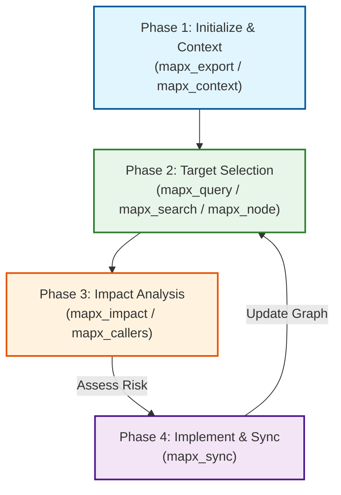

# LLM Agent Best Practices Guide

This guide describes how to configure and instruct LLM coding agents (like Claude Desktop, Cursor, Cline, Windsurf, or Aider) to get the maximum benefit from MapxGraph.

MapxGraph reduces agent token consumption by **up to 87%** while improving search precision. Instead of scanning entire directories or reading massive files to find code structures, agents can query MapxGraph's SQLite-backed code memory.

---

## Recommended Agent Workflow

To ensure agents solve tasks with high reliability and low token cost, instruct them to follow this four-phase workflow:

<!--  -->



### Phase 1: Exploration & Global Context
At the start of any conversation or task, the agent should establish a high-level mental map of the codebase.
* **Best practice**: The agent should call `mapx_export` (or `mapx_context` if a specific task or file is mentioned) to fetch a token-budgeted, PageRank-ranked summary of the workspace.
* **Why**: This takes less than 2,000 tokens (vs reading folders, which reads full files and drains context windows). It provides the agent with top classes, files, signatures, and imports.

### Phase 2: Targeted Querying
Once the agent understands the general structure, it must locate the exact code related to the task.
* **Best practice**: 
  * Use `mapx_query` to look up symbol definitions by name.
  * Use `mapx_search` with `--kind` filters (e.g., `class`, `method`) if name matching is too broad.
  * Use `mapx_node` with `source: true` to read only the exact implementation of a specific symbol rather than opening the entire file.

### Phase 3: Change Impact Analysis (Safety Check)
Before modifying any code, the agent must check the blast radius of the proposed changes.
* **Best practice**: Run `mapx_impact` on any symbols it plans to modify or refactor.
* **Why**: This performs a change risk and blast radius analysis up to a given depth. It will tell the agent exactly which other classes, methods, or route endpoints depend on this symbol and might break.

### Phase 4: Implement & Sync
After making the code changes:
* **Best practice**: The agent should run `mapx_sync` (which runs an incremental scan via git changes).
* **Why**: This updates MapxGraph's database with the new symbols, definitions, and relationships, ensuring the agent's memory remains accurate for subsequent tasks in the same session.

---

## Tool Selection Cheat Sheet

| Task | Tool to Use | Why | Avoid |
|------|-------------|-----|-------|
| **Get workspace overview** | `mapx_export` | Returns PageRank-ranked files, signatures, and dependencies under a token budget. | Reading directory listings and opening entry point files. |
| **Get task-specific context** | `mapx_context` | Computes PageRank relative to a specific "focus" symbol or file. | Exporting the entire graph or using broad search queries. |
| **Locate a symbol definition** | `mapx_query` / `mapx_search` | Instantly queries SQLite for the exact file path and signature. | Grepping or searching manually through files. |
| **View symbol source code** | `mapx_node` (with `source: true`) | Reads only the selected symbol implementation from the filesystem. | Reading the whole file using file-viewing tools. |
| **Trace who calls a method** | `mapx_callers` | Follows edges upstream to find all parent call chains. | Grepping for the method name across the project. |
| **Find API route controller** | `mapx_routes` | Maps HTTP verbs/paths directly to controller symbols/files. | Searching for route declaration files and tracing imports. |
| **Update graph after edit** | `mapx_sync` | Fast, incremental re-index of only the changed files. | Running `mapx_scan` (which does a full re-scan). |

---

## Custom System Prompts for Developer Agents

You can include the following instructions in your developer agent's system prompt (e.g., `.claudeprompt`, `.cursorrules`, or custom agent instructions) to enforce Mapx integration:

```markdown
# MapxGraph Integration Instructions

You have access to MapxGraph MCP tools. You MUST use them to navigate and analyze the codebase.

1. **Do not read files to understand project structure**: At the start of a session, call `mapx_export` or `mapx_context` to get a structured overview. Only read files when you need to make changes or inspect complex logic not covered in signatures.
2. **Always perform impact analysis**: Before modifying a function, class, or method, call `mapx_impact` on that symbol to check for reverse dependencies (blast radius). Summarize the risk of the change to the user before writing code.
3. **Locate symbols with precision**: When asked about a class or function, use `mapx_query` or `mapx_search` first to identify the exact file and line number.
4. **Utilize Framework Routing**: If the user asks about an API route, use `mapx_routes` to trace it to its handler controller, rather than searching route files.
5. **Sync changes**: Every time you modify or create files, call `mapx_sync` to keep the code graph updated.
```

---

## Advanced Workspace Strategies

### Monorepos and Peer Repositories
For projects with multiple microservices or package structures, agents should use the workspaces suite:
1. Run `mapx_workspaces` with action `discover` to scan for peer repos or submodules.
2. Register discovered workspaces via the CLI `mapx workspaces add <path>` so the agent can trace cross-repository edges and dependencies seamlessly.
