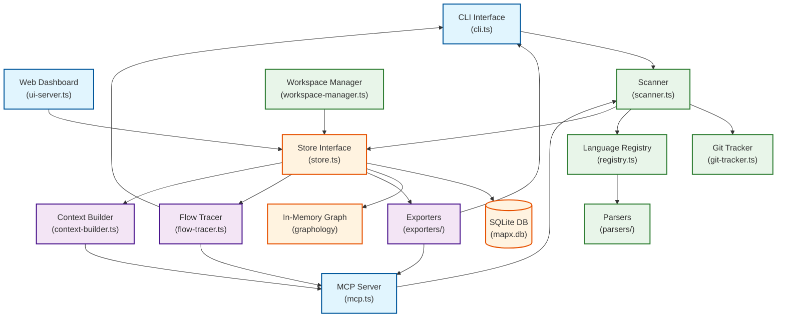
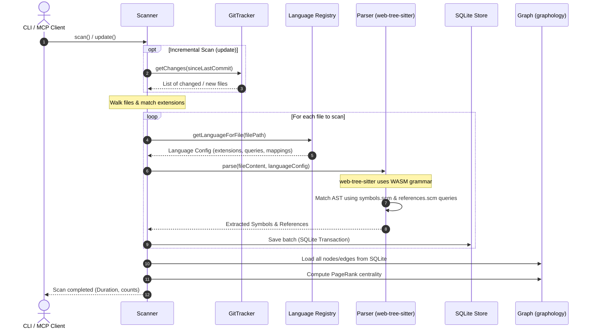
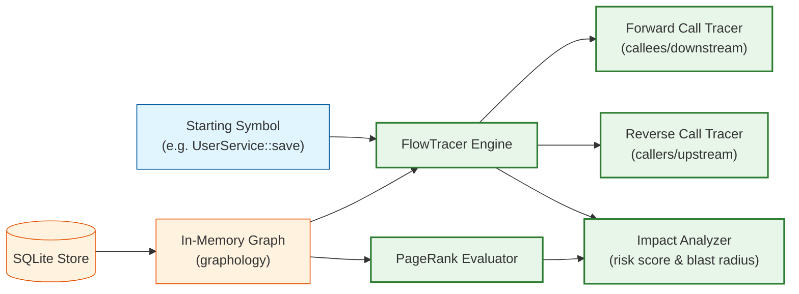

# Architecture

## Overview

MapxGraph is a local code graph memory system that provides persistent, structured understanding of codebases for LLMs. It supports **22 languages** across three tiers (built-in, bundled, installable) and provides **25 MCP tools** for LLM integration.

<!--  -->

## Core Components

### Scanner (`src/core/scanner.ts`)

Walks the filesystem, detects languages, orchestrates parsing, and stores results.

- **Full scan**: Walks all files, parses each with the appropriate language parser
- **Incremental scan**: Uses git blob-hash comparison to detect changed files, only re-parses those
- **Concurrent parsing**: File reads are parallelized via `Promise.all`; parsing uses bounded concurrency (up to 8 goroutine-style workers sharing a counter) to overlap async WASM I/O waits on the main thread
- **Write batching**: Parse results are written to SQLite in batches of 100 files per transaction, keeping WAL flush overhead low
- **Scan lock**: `scanFull` and `scanIncremental` write a PID lock file (`.mapx/scan.lock`) on entry and remove it on exit (or abort). If the lock exists and the recorded PID is still alive, the second scan fails immediately with a clear message. Stale locks (dead PID) are removed automatically.
- **Resilience**: Progress saved per-batch to SQLite meta table. Re-running `scan` resumes from where it left off after interruption (Ctrl+C)
- **Excludes**: `node_modules/`, `vendor/`, `.git/`, `dist/`, `.mapx/`, and configurable patterns
- **Framework detection**: Detects framework-specific patterns (Laravel, Express, Rails, etc.) during scanning

### Graph (`src/core/graph.ts`)

Uses `graphology` directed multigraph with PageRank centrality.

- **Nodes**: Files and symbols (classes, methods, functions, interfaces, enums, structs, modules, constants, properties, namespaces, traits)
- **Edges**: Dependencies (import, require, extends, implements, call, instantiation, use, include)
- **PageRank**: Computed on-demand to rank files/symbols by structural importance
- **Serialization**: Can export/import the full graph as JSON
- **Clustering**: Label propagation community detection with deterministic seeding

### Git Tracker (`src/core/git-tracker.ts`)

Uses git commands for change detection:

- `git ls-tree -r HEAD` — Get blob hashes for **all** tracked files in a single subprocess call (previously spawned one process per file)
- `git diff --name-status <since>` — Detect changes since last scan (working tree + commits)
- `git rev-parse HEAD` — Get current commit SHA
- `isGitRepo()` — Check if a directory is a git repository (used by `mapx init` for .gitignore handling)

### Store (`src/core/store.ts`)

SQLite abstraction with two backends:

- **Node.js**: Uses `better-sqlite3` (native C++ addon)
- **Bun**: Uses `bun:sqlite` (built-in)

Both backends are opened with `PRAGMA journal_mode = WAL` and `PRAGMA busy_timeout = 5000` so concurrent readers/writers wait up to 5 seconds instead of failing immediately with `SQLITE_BUSY`.

Tables: `files`, `symbols`, `edges`, `snapshots`, `meta`

The `meta` table stores scan state including:
- `last_scan_time` / `last_scan_commit` — For incremental change detection
- `scan_resume_state` — JSON state for interrupted scan recovery (completed files, symbol/edge counts)

### Language Registry (`src/languages/registry.ts`)

Central registry of all 22 supported languages with three tiers:

| Tier | Languages | WASM Path | Query Path |
|------|-----------|-----------|------------|
| **built-in** | PHP, JS, TS, Python, Go, Rust, Java, C# | `wasm/` (relative) | `queries/` (relative) |
| **bundled** | Ruby, C, C++, Swift, Kotlin, Dart, Scala, Vue | `wasm/` (relative) | `queries/` (relative) |
| **installable** | Svelte, Lua, Elixir, Zig, Bash, Pascal | `~/.mapx/grammars/` (absolute) | `~/.mapx/grammars/queries/` (absolute) |

Each language entry defines:
- `extensions` — File extensions to match
- `grammarWasm` — Path to tree-sitter WASM grammar
- `queries` — Paths to `symbols.scm` and `references.scm` query files
- `nodeMappings` — Maps `SymbolKind` values to AST node types for scope resolution and container detection
- `tier` — `built-in`, `bundled`, or `installable`

### Parsers (`src/parsers/`)

Language-specific parsers built on `web-tree-sitter` (WASM):

- **GenericWasmParser** — The primary parser for all languages. Uses tree-sitter queries (`.scm` files) with capture names like `@symbol.kind_class` and `@ref.target_import` to extract symbols and references. No per-language parser code is needed.
- **PhpParser** — Legacy parser with additional PHP-specific logic (framework detection, Composer awareness)
- Parsers are lazy-loaded (grammar WASM loaded on first use) and cached via `parserCache` in the registry
- **Concurrent-safe initialisation**: Each language class guards its `loadLanguage()` call with a stored `Promise` so that multiple concurrent parses of the same language share one initialization future rather than racing to load the WASM grammar multiple times
- `parseWithQueries` creates a fresh `Parser` instance per call (no shared singleton), enabling safe concurrent invocation from multiple async tasks
- Language detection by file extension via the registry

### Flow Tracer (`src/core/flow-tracer.ts`)

Traces data flow paths through the graph:

- **Forward tracing**: Follow calls/references from a starting symbol
- **Reverse tracing**: Trace back to find callers/dependents
- **Sources**: Entry points with no incoming edges
- **Sinks**: Terminal nodes with no outgoing edges
- **Impact analysis**: Multi-depth blast radius and risk scoring
- Configurable `--max-depth` (default: 3) with deterministic seeding for clustering

### Context Builder (`src/core/context-builder.ts`)

Generates intelligent, token-budgeted context for LLM prompts:

- Ranks files/symbols by relevance to a focus target
- Applies token budgets via binary search truncation
- Includes structural context (imports, exports, signatures)

### Workspace Manager (`src/core/workspace-manager.ts`)

Manages multi-repository workspaces:

- Register, remove, list repositories
- Discover submodules, peer repos, VS Code workspace folders
- Cross-repo edge tracking

### Exporters (`src/exporters/`)

- **LLM Exporter**: Compact ranked summary (Aider's Repo Map pattern)
  - PageRank-ranked files and symbols
  - Token-budgeted output with binary search truncation
  - Only shows signatures, not implementation bodies
- **Graph Exporter**: Full JSON with all data
- **DOT Exporter**: GraphViz DOT format with cluster-aware rendering
  - `cluster: 'none'` — flat rendering (all files as top-level nodes)
  - `cluster: 'auto'` — subgraph clustering by directory
  - `depth` — max nesting depth (flattens beyond)
- **SVG Exporter**: SVG visualization with two rendering paths:
  - `dot -Tsvg` when GraphViz is installed (high-quality graphviz layout)
  - Built-in fallback renderer (PageRank-weighted opacity, language colors, bezier edges)
- **TOON Exporter**: Compact delimited format with key-folding options
  - `delimiter: 'comma' | 'tab' | 'pipe'`
  - `keyFolding: boolean` — collapse single-key chains into dotted paths

### MCP Server (`src/mcp.ts`)

Model Context Protocol server with 25 tools:

- **Transports**: stdio (default) and SSE (HTTP)
- **Tools**: scan, sync, query, search, node, files, dependencies, callers, callees, trace, sources, sinks, impact, clusters, status, export, context, workspaces, lang_list, lang_install, lang_uninstall
- Configuration snippet generation for Claude Desktop, Cursor, VS Code, and opencode

### CLI Progress Display (`src/cli.ts`)

Visual progress for scan operations:
- **Discover phase**: Spinner + file count (indeterminate)
- **Index phase**: Progress bar with percentage and file name
- **Parse phase**: Progress bar with percentage and file name
- **Update command**: Change detection + parse progress for changed files
- Phase transitions marked with checkmarks

## Data Flow

1. `init` → Creates `.mapx/` + `AGENTS.md` (with `<!-- mapx -->` markers) + auto-adds `.mapx/` to `.gitignore`
2. `scan` → Scanner walks files → Parser extracts symbols/refs via tree-sitter queries → Store persists to SQLite → Graph builds in-memory
3. `export` → Store loads data → Graph computes PageRank → Exporter renders output (to stdout or file)
4. `update` → GitTracker detects changes → Scanner re-parses changed files → Store updates
5. `query` → Store searches SQLite → Returns matching symbols with locations
6. `deps` → Graph traverses edges → Returns dependency tree
7. `trace` → FlowTracer walks call/dependency chains → Returns flow paths
8. `impact` → FlowTracer computes blast radius → Returns affected symbols with risk scores
9. `callers`/`callees` → FlowTracer traces call chains in specified direction
10. `serve` → Starts MCP server → Exposes all functionality as 25 tools

## Process Flow Diagrams

### 1. Scanning & Indexing Sequence Flow
This diagram illustrates the step-by-step lifecycle of a project scan, from Git diff analysis to parallel parsing and SQLite persistence.

<!--  -->

### 2. Flow Tracing & Change Impact Blast Radius
This diagram details how FlowTracer traverses the graph to resolve callers, callees, data flow, and change risk scores.

<!--  -->

