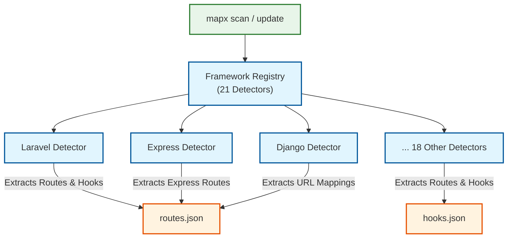

# Framework & Routing Integration

MapxGraph features built-in framework detection and automatic route/hook extraction for **21 popular web frameworks** across multiple languages. This allows developers and LLMs to map external HTTP requests and event triggers directly to their implementing files and handler symbols.

## How It Works

During a codebase scan (via `mapx scan` or `mapx update`), MapxGraph executes framework-specific detectors to:
1. **Detect Active Frameworks**: Checks project configuration files (e.g., `package.json`, `composer.json`, `requirements.txt`, `Gemfile`) and matches file extension patterns or directory structures.
2. **Extract API Routes**: Parses routing configurations to map HTTP verbs (GET, POST, PUT, DELETE, etc.) and URL path patterns to their handler files and controller symbols.
3. **Extract Hooks & Events**: Maps event listener bindings (e.g., WordPress actions/filters, Laravel event listeners) to their respective handler functions.
4. **Persist Registry**: Saves findings to `.mapx/routes.json` and `.mapx/hooks.json` to keep them queryable.

<!--  -->



---

## Supported Frameworks (21 total)

| Framework | Language | Heuristic & Scope |
|-----------|----------|-------------------|
| **Laravel** | PHP | Composer dependencies (`laravel/framework`), routes files, controller method mappings, event listeners, and hooks. |
| **Express** | JavaScript / TypeScript | Package dependency (`express`), `app.use()` route prefixes, inline controllers, and modular router mappings. |
| **Django** | Python | Heuristic checks for `manage.py`, `wsgi.py`, pattern matching on `urlpatterns`, class-based and function views. |
| **Flask** | Python | Heuristic checks on imports, `@app.route()`, and Blueprint registrations. |
| **FastAPI** | Python | Heuristic checks on imports, `@app.get()`, `@app.post()`, and APIRouter mountings. |
| **NestJS** | TypeScript | Package dependency (`@nestjs/core`), `@Controller()` classes, and `@Get()/@Post()` method decorators. |
| **React Router** | JS / TS | Checks routes definition arrays, `<Route path="..." element={...}>` declarations. |
| **TanStack Router** | JS / TS | Package dependency (`@tanstack/react-router`), parses route files and directory-based routes. |
| **Next.js** | JS / TS | Page routing layouts (`pages/` directory or `app/` directory routes matching `/route.ts`, `page.tsx`). |
| **SvelteKit** | Svelte / JS / TS | Directory structure (`src/routes/`), parses page endpoint routing scripts (`+page.svelte`, `+server.ts`). |
| **Vue Router** | JS / TS | Package dependency (`vue-router`), routes arrays, lazy-loaded route bundle declarations. |
| **Drupal** | PHP | Checks for `.info.yml` files, custom routes yml, hooks, and theme hook registrations. |
| **Rails** | Ruby | Checks for `Gemfile` containing `rails`, parses `config/routes.rb` files. |
| **Spring** | Java | Checks for `@RestController`, `@RequestMapping`, `@GetMapping`, and `@PostMapping` annotations. |
| **Go (Gin/Fiber)** | Go | Scans imports for `github.com/gin-gonic/gin` or `github.com/gofiber/fiber`, extracts router configurations. |
| **Rust (Actix/Axum)**| Rust | Scans imports for `actix-web` or `axum`, parses handler macros and routing setups. |
| **ASP.NET** | C# | Scans for `Microsoft.AspNetCore`, `[Route]` attributes, and minimal API route builders. |
| **Vapor** | Swift | Scans `Package.swift` and routes code declarations mapping methods to controllers. |
| **Symfony** | PHP | Composer dependencies (`symfony/framework-bundle`), annotations/attributes, YAML routes. |
| **Yii** | PHP | Heuristics on controller actions (`actionIndex`) and URL rules. |
| **WordPress** | PHP | Detects theme and plugin structures, extracts `add_action()` and `add_filter()` hooks. |

---

## CLI Usage

Use the CLI to inspect and query routes and event hooks:

### 1. Listing and Querying Routes

```bash
# Show all detected routes in the codebase
mapx routes

# Filter routes by framework
mapx routes --framework express

# Filter routes by HTTP method
mapx routes --method POST

# Filter routes by URL path pattern
mapx routes --path-pattern "/api/v1/users"

# Output as raw JSON for external integration
mapx routes --json
```

**CLI Output Example:**
```
Detected Routes (3):
--------------------------------------------------------------------------------
Framework    | Method   | Path                           | Handler
--------------------------------------------------------------------------------
express      | GET      | /api/users                     | src/controllers/UserController.ts#listUsers
express      | POST     | /api/users                     | src/controllers/UserController.ts#createUser
express      | DELETE   | /api/users/:id                 | src/controllers/UserController.ts#deleteUser
--------------------------------------------------------------------------------
```

### 2. Listing and Querying Hooks

```bash
# Show all registered hooks, actions, filters, or event listeners
mapx hooks

# Filter hooks by framework
mapx hooks --framework wordpress

# Filter hooks by event type (e.g. action, filter, event)
mapx hooks --type action

# Filter hooks by hook name pattern
mapx hooks --name "user_register"

# Output hooks as JSON
mapx hooks --json
```

**CLI Output Example:**
```
Detected Hooks (2):
--------------------------------------------------------------------------------
Framework    | Type            | Hook Name                 | Handler
--------------------------------------------------------------------------------
wordpress    | action          | user_register             | inc/notify.php#send_welcome_email
wordpress    | filter          | the_content               | inc/filters.php#add_social_links
--------------------------------------------------------------------------------
```

---

## MCP Tools Integration

When integrating MapxGraph with LLM agents (e.g., Claude Desktop, Cursor), two specialized tools are exposed:

### `mapx_routes`
Query routes from all detected frameworks.
* **Arguments**:
  * `framework` (string, optional) — Filter routes by framework name (e.g., `laravel`, `express`).
  * `method` (string, optional) — Filter routes by HTTP method (e.g., `GET`, `POST`).
  * `pathPattern` (string, optional) — Filter routes by route path pattern.
  * `dir` (string, optional) — Target project directory.

### `mapx_hooks`
Query hooks/events from all detected frameworks.
* **Arguments**:
  * `framework` (string, optional) — Filter hooks by framework name.
  * `type` (string, optional) — Filter by hook type (e.g., `action`, `filter`, `listener`).
  * `namePattern` (string, optional) — Filter by hook name pattern.
  * `dir` (string, optional) — Target project directory.

---

## Developer Workflows

Here are common use cases for developer agents using framework-specific routes:

1. **Bug Resolution**: When a client reports that `POST /api/v1/checkout` fails, the agent can call `mapx_routes` to find that this route is handled by `CheckoutController::processCheckout` in `src/controllers/CheckoutController.php`, then inspect that code immediately.
2. **Impact Assessment**: Before modifying a controller method, an agent can check if it is hooked to any framework events or is exposed via specific API endpoints, helping preserve backward compatibility.
3. **Refactoring / Cleanup**: Finding dead controller endpoints or orphaned event listeners that are defined in routes but have no actual active code dependencies.
